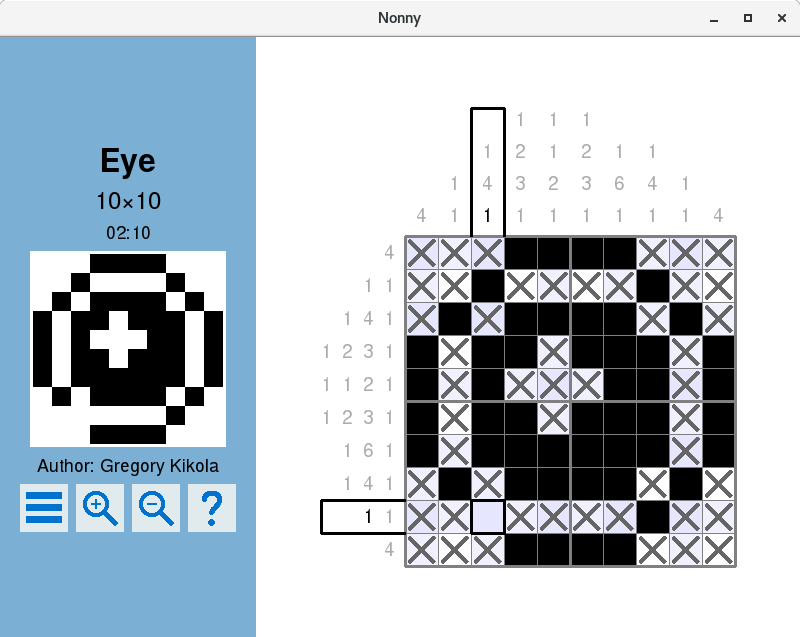
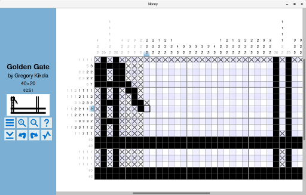
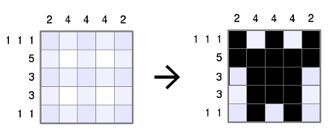
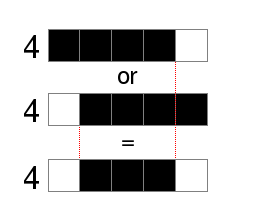
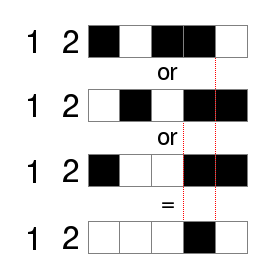
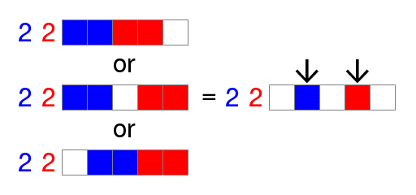

Nonny
=====


Description
-----------

Nonny lets you play and create nonogram puzzles! Nonograms (also known
as Griddlers, Picross, and Paint-by-Number) are logic puzzles played
on a grid of squares. The squares are filled in or left blank
according to numeric clues at the sides of the grid. When the puzzle
is finished, the filled-in squares form a picture.



Nonny comes packaged with a selection of puzzles for you to play, and
you can easily import puzzles from other sources. Nonny also allows
you to create your own puzzles. There is a built-in solver which can
be used to verify that your puzzles have only one solution.



Nonny tracks your completion status and times for each puzzle, and you
may save your progress on a puzzle and resume solving it at a later
time.


Current Features
----------------

* Can play both standard and multicolor nonograms
  * Tracks completion status for all puzzles
  * Tracks time spent on solving each puzzle and records best completion
    times
  * Will save your progress on unfinished puzzles
  * Optional hint system shows you which lines can be further solved
  * No explicit limits on puzzle size or complexity
  * Information panel shows details about the current puzzle and
    shows a snapshot of the puzzle grid
* Can create both standard and multicolor nonograms
  * Various drawing tools are available: draw lines, rectangles,
    and ellipses, or fill regions with a particular color
  * Allows you to save title, author, and copyright information for
    each puzzle you create
* Undo and redo commands can be used while solving or
  editing puzzles
* Built-in solver and analysis tool
  * Will solve most simple puzzles very quickly
  * Can solve puzzles which require guessing or multi-line reasoning
  * Can determine whether a puzzle has a unique solution
  * Can determine whether a puzzle is solvable one line at a time
  * Can find and display multiple solutions for a puzzle
* File selector displays puzzle information and allows you to load
  and save puzzles anywhere and in various file formats
  * Supports the
    [.non format](http://www.lancaster.ac.uk/~simpsons/nonogram/fmt2)
    used in Steven Simpson's solver, extended with multicolor support
  * Supports the .g and .mk formats used in
    [Mirek Olšák and Petr Olšák's solver](http://www.olsak.net/grid.html#English)
  * Supports the .nin format used by
    [Jakub Wilk's solver](https://jwilk.net/software/nonogram)


What Is a Nonogram?
-------------------

Nonograms are logic puzzles originating from Japan. You start with a
blank grid and then fill in the cells according to the clue numbers at
the sides. When you finish the puzzle, you're left with a picture to
look at:



For example, a clue of "4" means that you need to fill in four
consecutive blocks somewhere within that line. By considering the
different possible positions you can determine that some of the cells
in the line must be filled:



Similarly, a clue of "1 2" means that one cell is to be filled,
followed by a gap of at least one blank cell, followed by two
consecutive filled cells:



By working line by line in this way, you can solve most
puzzles. Harder puzzles may require more advanced techniques, but
well-made puzzles should not require guessing.

Nonny also supports multicolor puzzles. These puzzles work the same way,
but each clue number is colored to indicate which color the cells must
be painted:


Adjacent blocks of cells of different colors need not have a gap
between them. For example, a blue 2 followed by a red 2 means that
there are two consecutive blue cells, possibly but not necessarily
followed by a gap, followed by two consecutive red cells:



Again, by considering the different possibilities you can find cells
that must be filled in, which gives you more information to solve the
other lines in the puzzle.


Development Status
------------------

Nonny should be ready for its initial, preliminary release within the
next several days, probably on or before June 16th, 2017. Windows
binaries will be provided then.


Installation
------------

Windows binaries will be provided soon. To build Nonny yourself,
you'll need [CMake](https://cmake.org/) 3.1 or later,
[SDL2](https://www.libsdl.org/),
[SDL2_image](https://www.libsdl.org/projects/SDL_image/), and
[SDL2_ttf](https://www.libsdl.org/projects/SDL_ttf/).

GNU/Linux build and install example:
```
git clone https://github.com/gkikola/nonny.git
cd nonny
mkdir build
cd build
cmake ..
make
sudo make install
```


Copyright
---------

Nonny is copyright &copy; 2017 Gregory Kikola. License GPLv3+:
[GNU GPL version 3 or later](http://www.gnu.org/licenses/gpl.html).

Nonny is free software: you are free to change and redistribute it. There
is NO WARRANTY, to the extent permitted by law. See the file
[COPYING](COPYING) for more details.
